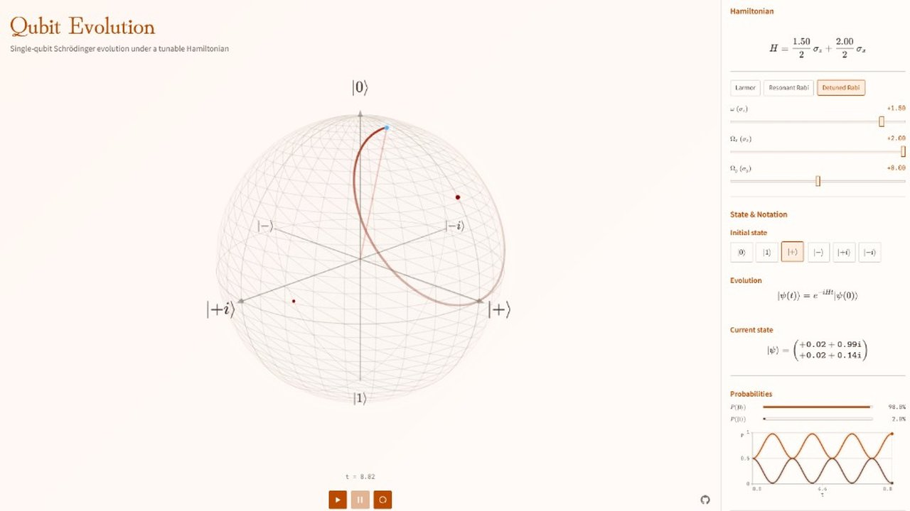
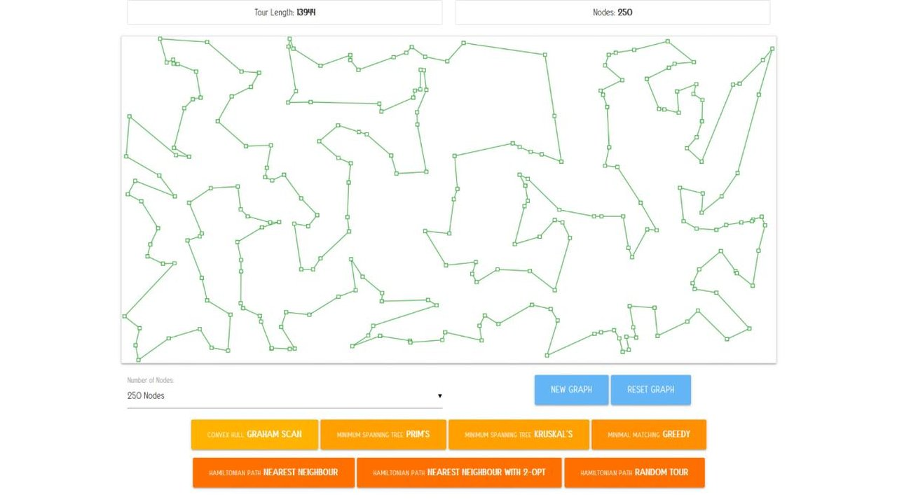
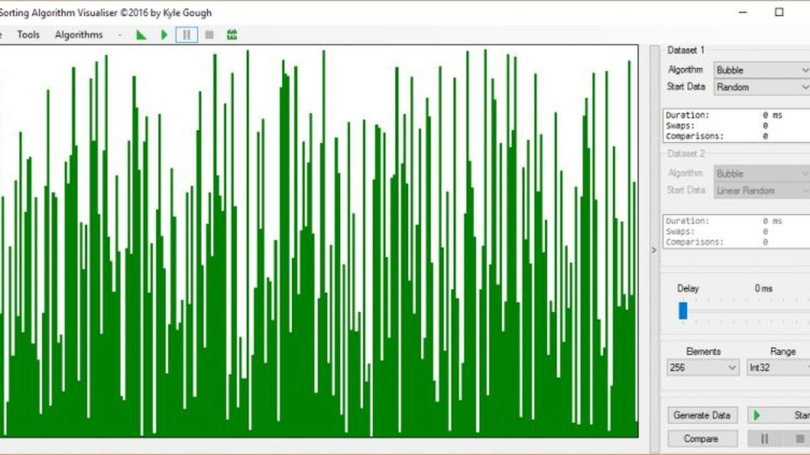
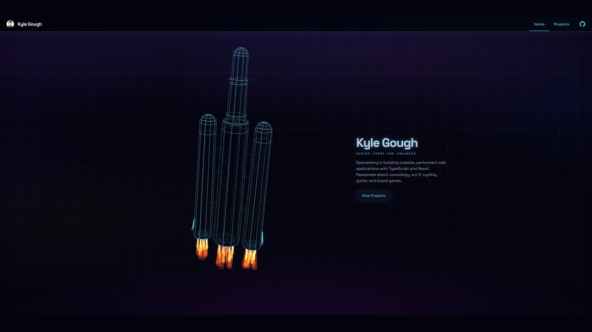

<h1 align="center">Hello, I'm Kyle :metal:</h1>

  
  
  

<table>
  <tr>
    <td width="33%" style="padding:2px"></td>
    <td width="33%" style="padding:2px"></td>
    <td width="33%" style="padding:2px"></td></tr>
  <tr>
    <td width="33%" style="padding:2px"></td>
    <td width="33%" style="padding:2px"></td>
    <td width="33%" style="padding:2px"></td></tr></table>
