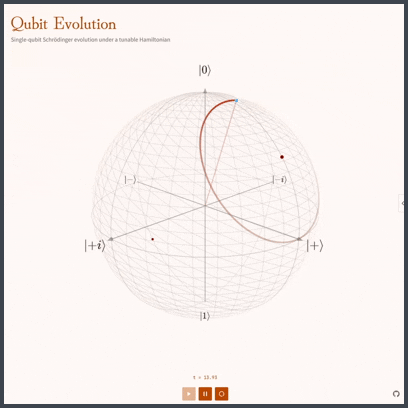
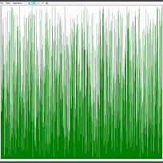
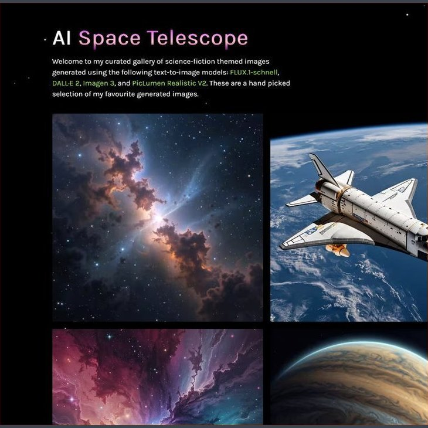
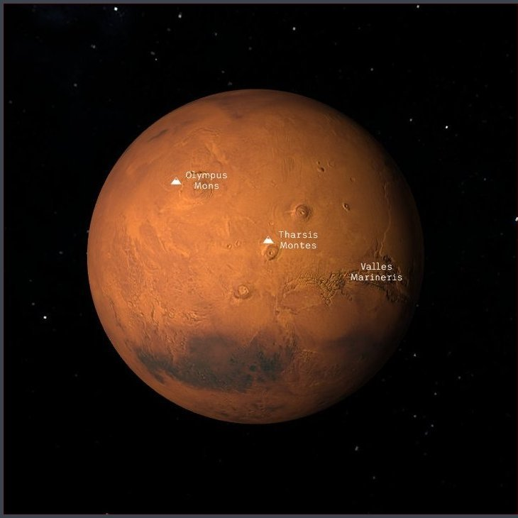
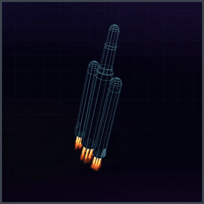

  
  
  

 

Hello, I'm Kyle, a Senior front-end engineer at Ripjar, working mostly with TypeScript and React, and I love to build interactive web apps. Passionate about cosmology, sci-fi, cycling, guitar, and board games.

 

